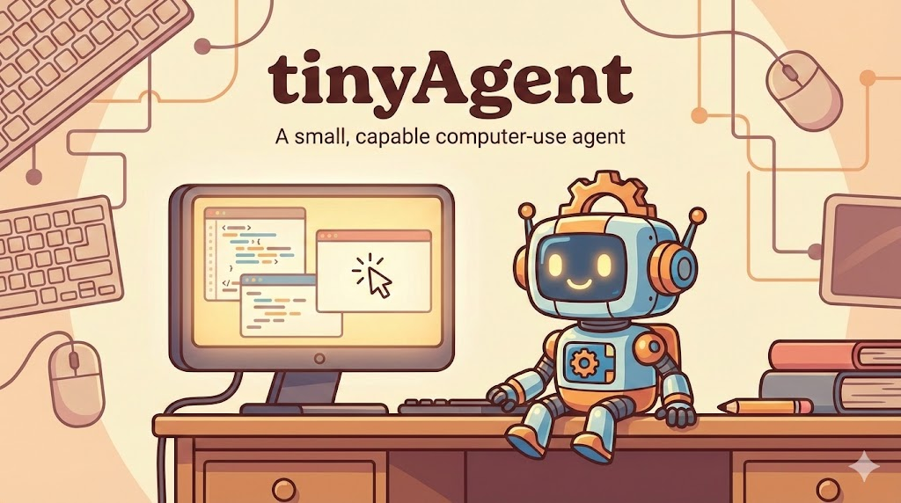

tinyAgent is a small, example-like implementation of how general computer-use agents are built. 

It (unless you disable some tools) can see and control your computer! It has an auto-, or ask-approve models. `Auto` is only if you feel adventurous, the model will be free to execute whatever it thinks will accomplish the task you gave it, without asking you for tool exection. `Ask` will first show you what it wants to do and ask for approval.  

tinyAgent only responds in tool calls (messages to user are also a tool call) which usually results in better task performance. 

It's simple to extend tinyAgents capabilities, by adding a new tool in `tools/tools.py`. You are welcome to add new tools and experiment! 

Most agent performance gains come from:

- **adding smart tools**, ie. sometimes even if we have tools like press_combo that allows for combos like `win+r`, it is worth to add specific tool that calls `win+r` specifically if we see that this action is performed often or maybe we want to add a better tool description for `tool_win_r` specifically
- **making the tool descriptions better**, more precise, more descriptive, maybe with simple use-case examples
- **having good instruction prompt guardrails**, sometimes you need to give a little push as to when and how to use the tool in the prompt instead of tool description

All of the above will slowly go away as we progreess through more and more capable models as agents.

What you care for right now is **implicit multimodality**. There is no general computer-, mobile- or any other device-use agent without vision module provided in some way. At least when we still assume a human-like interaction. Most of current top models can understand pictures well and reason on them, unfortunately, very few can properly use the pictures (ie. click on specific thing or infer coordinates). Hence you either use a good, coordinate-aware model from the get go or implement a tool that knows how to click.

**For simplicity I suggest to use Gemini**.

A very barebones agent prompt is located in agent_system_prompt.txt. Its the place where you will spend the most of time if you really want your agent to perform. 

This implementation does not have specific memory/context managing for simplicity.

Enjoy!

## Quickstart

```bash
# Python 3.13+
uv sync
uv run main.py
```

Alternative install path:

```bash
python3 -m venv .venv
source .venv/bin/activate
pip install -e .
python3 main.py
```

On first run, tinyAgent opens a setup wizard (provider, model, tools, approval strategy) and saves it to `.tinyagent.config.json`.

## Providers + API keys

Supported providers:
- Google Gemini (`GEMINI_API_KEY`)
- OpenAI (`OPENAI_API_KEY`)

Keys are loaded from environment variables first, then from `.secret` in the repo root.

Example `.secret`:

```json
{
  "GEMINI_API_KEY": "...",
  "OPENAI_API_KEY": "..."
}
```

## Core loop

1. You give a task.
2. The model communicates in tool calls: either respond to user or take action
3. Tool calls are either approval-gated (`ask`) or auto-run (`auto`).
4. The model yields control by calling `return_to_user(message=...)`.

## Built-in tools

- `move_mouse(x, y)` (normalized coordinates in `[0, 1]`)
- `click(x, y, button="left")`
- `type(text, interval_ms=0)`
- `press_combo(*keys, hold_ms=0)`
- `screenshot()`
- `return_to_user(message)` (always enabled handoff tool)

## Runtime commands

- `/help`
- `/prompt`
- `/status`
- `/strategy [ask|auto]`
- `/reconfigure`
- `/tools`
- `/history`
- `/clean`
- `/exit`

## Debug mode

```bash
uv run main.py --debug
```

Writes artifacts to `debug/run-<timestamp>/`:
- `history_requests.json`
- `responses.json`
- `screenshots/turn_XXXX.png`

## Code map

- `main.py`: interactive loop and tool/handoff orchestration
- `model_client.py`: base client + Gemini/OpenAI adapters
- `setup.py`: setup wizard + session config persistence
- `tools/`: callable desktop tools
- `tests.py`: local test runner
